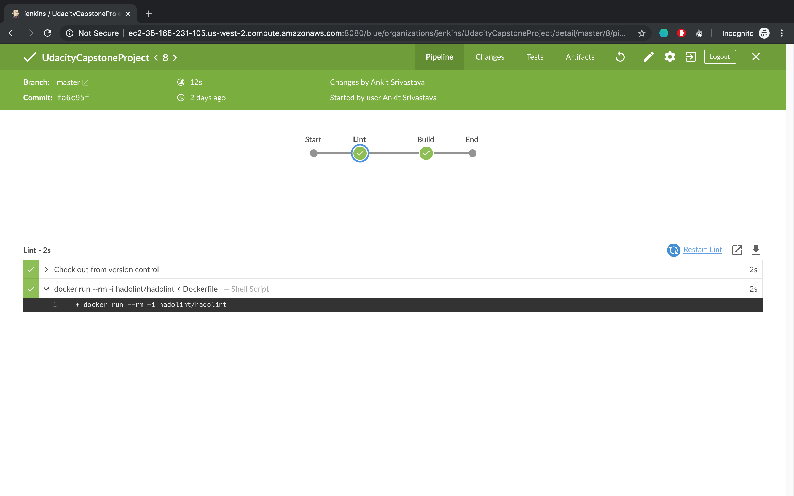

# Udacity Final Project: Capstone

Building and deploying nginx sample project to AWS EKS cluster using Jenkins and Cloudformation.

### Environment Setup: 

1. Install Jenkins locally or on EC2 instance.

Follow below steps to install Jenkins on Ubuntu:

```
sudo apt-get update
sudo apt install -y default-jdk
wget -q -O - https://pkg.jenkins.io/debian/jenkins.io.key | sudo apt-key add -
sudo sh -c 'echo deb https://pkg.jenkins.io/debian-stable binary/ > /etc/apt/sources.list.d/jenkins.list'
sudo apt-get update
sudo apt-get install -y jenkins
```

Following list of Jenkins plugins used for this project:

- [Blue Ocean](https://wiki.jenkins.io/display/JENKINS/Blue+Ocean+Plugin)
- [AWS CodePipeline](https://wiki.jenkins.io/display/JENKINS/AWS+CodePipeline+Plugin)
- [Pipeline AWS](https://wiki.jenkins.io/display/JENKINS/Pipeline+AWS+Plugin)
- [Amazon ECR](https://wiki.jenkins.io/display/JENKINS/Amazon+ECR)

2. AWS CLI (https://docs.aws.amazon.com/cli/latest/userguide/cli-chap-install.html)
3. Kubectl (https://docs.aws.amazon.com/eks/latest/userguide/install-kubectl.html)

## Usuage

#### 1. Build deployment pipeline using Jenkins

a. I've used Jenkins Blue Ocean to configure this project. Jenkins file is added to this repository.


Below are the images for Jenkins pipeline:

- Lint stage failing due to incorrect usuage.


- Lint stage passes after update.



- Pipeline run after successfully pushing Docker image to AWS ECR.


AWS ECR dashboard:


#### 2. Deploying to AWS EKS cluster

a. Create infra stack using following cloudformation script.

```
./create-stack.sh CapstoneProject capstone-eks-vps.yaml
```


b. Create EKS structure from the Dashboard. One can use below commands as well:

```
aws eks --region <region> create-cluster --name <clusterName> 
--role-arn <EKS-role-ARN> --resources-vpc-config 
subnetIds=<subnet-id-1>,<subnet-id-2>,<subnet-id-3>,securityGroupIds=
<security-group-id>
```


c. Create a kubeconfig File

```
aws eks --region us-west-2 update-kubeconfig --name Capstone
```


d. Test Kubeconfig configuration. You should get below output.

```
kubectl get svc
```


e. Configure worker nodes using below cloudformation script.

```
aws cloudformation create-stack --stack-name Capstone-eks-worker-stack --template-body file://capstone-eks-nodegroup.yaml --parameters file://eks-worker-group-parameters.json --capabilities CAPABILITY_NAMED_IAM
```


f. Enable worker nodes to join cluster.

Download configuration map file using below: 

```
curl -o aws-auth-cm.yaml https://amazon-eks.s3-us-west-2.amazonaws.com/cloudformation/2019-10-08/aws-auth-cm.yaml
```
<Replace the <ARN of instance role (not instance profile)> snippet with the NodeInstanceRole value that you recorded in the previous worker node stack step.>


```
kubectl apply -f aws-auth-cm.yaml
```
Watch the status of the created nodes.

```
kubectl get nodes --watch
```


g. Launching app inside the Kubernetes cluster

Deploy below deployment file and a service file.

```
kubectl apply -f nginx.yaml
kubectl apply -f nginx-service.yaml
```

Run below to get the details of nginx app in the  cluster.

```
kubectl get svc nginx -o yaml
```

Output:


Access application on the browser.


